# algoritmos-busca-paralela-java

## Como rodar

Você também pode abrir o arquivo `Main.java` na IDE e apertar no `Play`.

Ou, na raiz do projeto, execute:

```bash
java -cp out Main
```

Esse comando inicia a classe `Main` usando as classes compiladas na pasta `out`.

## Artigo

### Análise de Desempenho de Algoritmos de Ordenação em Ambientes Concorrentes e Paralelos

**Universidade de Fortaleza**  
**Centro de Ciências Tecnológicas**  
**Curso:** Ciência da Computação

**Autores:** Matheus Diógenes Amorim, Matheus Holanda de Sá  
**Palavras-chave:** Algoritmos de ordenação, programação paralela, concorrência, ForkJoinPool, análise de desempenho.  
**Link do projeto citado no artigo:** [github.com/MatheuzinDev/algoritmo-busca-paralela-java](https://github.com/MatheuzinDev/algoritmo-busca-paralela-java)

## Índice

1. Resumo
2. Introdução
3. Metodologia
4. Resultados e Discussão
5. Conclusão
6. Referências

## Resumo

A incessante demanda por desempenho computacional tem incentivado a utilização de abordagens concorrentes e paralelas na resolução de problemas que envolvem grandes volumes de dados. Assim, os algoritmos de ordenação são fundamentais, uma vez que são vastamente utilizados em várias aplicações e impactam diretamente a eficiência dos sistemas. Este trabalho apresenta uma análise comparativa do desempenho de algoritmos de ordenação implementados em Java, com suas versões seriais e paralelas dos métodos Quick Sort, Merge Sort, Insertion Sort e Selection Sort.

Para a realização dos experimentos, um framework de testes foi desenvolvido, capaz de variar o tamanho e a natureza dos conjuntos de dados de entrada, bem como a quantidade de threads usadas nas execuções paralelas. Cada cenário foi executado com múltiplas amostras, os tempos de execução foram registrados e organizados em arquivos CSV para uma análise estatística. Além disso, um painel gráfico em Java Swing foi implementado para facilitar a visualização dos resultados obtidos. Com isso, espera-se identificar padrões de desempenho, avaliar os ganhos proporcionados pelo paralelismo e compreender em quais condições cada algoritmo apresenta maior eficiência.

## Introdução

A evolução da computação sempre esteve diretamente associada à busca por maior capacidade de processamento, menor tempo de resposta e melhor aproveitamento dos recursos disponíveis. Desde os fundamentos teóricos da ciência da computação até a consolidação dos sistemas digitais modernos, o desenvolvimento da área foi impulsionado pela necessidade de processar volumes crescentes de dados de forma cada vez mais eficiente. Com o avanço da tecnologia e a expansão de aplicações computacionais em áreas como sistemas corporativos, redes, inteligência artificial, bancos de dados e plataformas digitais, o desempenho passou a ser um dos principais critérios de qualidade de software.

Nesse contexto, a escolha do algoritmo certo deixou de ser apenas uma decisão teórica, pois afeta diretamente o tempo de resposta e o consumo de recursos em sistemas reais. Entre esses algoritmos, os métodos de ordenação se destacam por sua ampla aplicação prática, já que ordenar informações é uma etapa comum em diversas tarefas computacionais, como busca, indexação, análise de dados, processamento de registros e otimização de operações internas de sistemas. Além disso, o estudo de algoritmos de ordenação é tradicionalmente utilizado na ciência da computação como base para a análise de complexidade, eficiência e comportamento assintótico, o que permite comparar soluções distintas diante de diferentes cenários de entrada.

Entre os algoritmos de ordenação mais conhecidos, há diferenças estruturais relevantes que influenciam diretamente seu desempenho. Métodos como Quick Sort e Merge Sort são amplamente reconhecidos por sua eficiência em grandes conjuntos de dados, normalmente associados à complexidade de ordem `O(n log n)` em seus casos médios ou garantidos, enquanto algoritmos como Insertion Sort e Selection Sort, embora mais simples de implementar e compreender, apresentam comportamento quadrático em muitos cenários, com complexidade `O(n²)`. Essas diferenças tornam a comparação entre algoritmos especialmente importante quando se deseja avaliar não apenas a corretude, mas também a escalabilidade e o custo computacional de cada abordagem.

A arquitetura dos computadores modernos, porém, mudou a equação. Em vez de depender exclusivamente do aumento da frequência dos processadores, a indústria passou a investir fortemente em arquiteturas multicore, o que torna a concorrência e o paralelismo elementos fundamentais para o desenvolvimento de aplicações de alto desempenho. Enquanto a concorrência está relacionada à administração eficiente de múltiplas tarefas em execução, o paralelismo busca a execução simultânea de partes de um problema, explorando melhor os recursos de hardware disponíveis. Em algoritmos recursivos ou baseados em divisão de tarefas, como ocorre em determinados métodos de ordenação, o paralelismo pode proporcionar ganhos relevantes de desempenho, desde que a sobrecarga de coordenação entre threads não ultrapasse os benefícios obtidos.

A linguagem Java se mostra adequada para esse tipo de investigação por disponibilizar mecanismos robustos para programação concorrente e paralela, que incluem abstrações de alto nível para gerenciamento de tarefas e threads. Entre esses mecanismos, destaca-se o `ForkJoinPool`, amplamente utilizado para decompor problemas em subtarefas menores e distribuí-las entre múltiplos núcleos de processamento. Esse modelo favorece especialmente algoritmos com estrutura recursiva, como Quick Sort e Merge Sort, e permite analisar, de forma prática, o impacto do paralelismo sobre o tempo de execução em diferentes configurações.

É nesse cenário que este trabalho se insere: analisar comparativamente o desempenho de quatro algoritmos de ordenação implementados em Java, em versões seriais e paralelas: Quick Sort, Merge Sort, Insertion Sort e Selection Sort. Para isso, foram realizados experimentos com diferentes tamanhos e tipos de entrada, múltiplas amostras por cenário e variação no número de threads utilizadas. Os resultados foram registrados em arquivos CSV e organizados para análise estatística e visual, o que possibilita investigar o comportamento de cada algoritmo sob distintas condições de processamento e identificar em quais situações o uso do paralelismo se mostra mais vantajoso.

## Metodologia

Este trabalho foi desenvolvido por meio da implementação prática e da análise experimental de algoritmos de ordenação em linguagem Java, com foco na comparação entre execuções seriais e paralelas. A pesquisa concentrou-se principalmente no estudo do comportamento dos algoritmos Quick Sort, Merge Sort, Insertion Sort e Selection Sort, com foco em compreender suas características, seus custos computacionais e seu desempenho em diferentes cenários de processamento.

A partir dos experimentos realizados, os resultados foram organizados em arquivos CSV para facilitar o processamento e a análise posterior. Como complemento a essa etapa, foi utilizada uma interface gráfica em Java Swing para a visualização dos dados, o que permite observar de forma mais clara o impacto do paralelismo, da quantidade de threads e do tipo de entrada sobre o desempenho de cada algoritmo. Dessa forma, a metodologia adotada possibilita uma avaliação objetiva e comparativa da eficiência dos métodos de ordenação em ambientes concorrentes e paralelos.

## Resultados e Discussão

Neste tópico, é feita uma análise dos resultados obtidos nos testes de desempenho realizados com os algoritmos de ordenação implementados neste trabalho, mostrando como cada método se comporta diante de variações no tipo de entrada, no modo de execução e na quantidade de threads. A organização comparativa permite enxergar tanto os ganhos quanto as limitações de cada abordagem.

### 1. Quick Sort e Merge Sort

Primeiramente, foram analisados o Quick Sort e o Merge Sort, dois algoritmos de complexidade média `O(n log n)`, cuja estrutura recursiva os torna candidatos naturais à paralelização. A ideia aqui é observar como esses métodos se comportam quando sujeitos à execução serial e paralela, como reagem a diferentes tipos de entrada e até que ponto o aumento do número de threads produz, de fato, algum ganho real de desempenho.

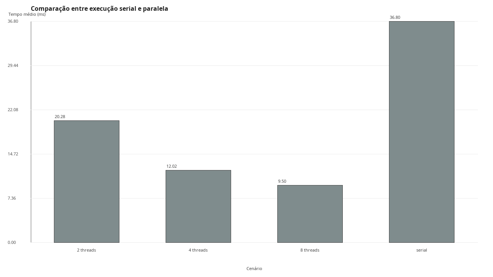

*Figura 1. Comparação entre execução serial e paralela do Quick Sort.*

A Figura 1 mostra o comportamento do Quick Sort no maior cenário disposto para esse algoritmo, com entrada aleatória de 500.000 elementos. A execução serial apresentou tempo médio de 36,795 ms, enquanto as execuções paralelas registraram cerca de 20,284 ms com 2 threads, 12,025 ms com 4 threads e 9,505 ms com 8 threads. Esses valores correspondem a speedups aproximados de 1,814, 3,060 e 3,871 em relação à versão serial, colocando em evidência que o aumento do número de threads produziu redução consistente no tempo de execução.

Esse resultado é explicado pela natureza do próprio Quick Sort, que divide o vetor em subproblemas menores a partir de uma etapa de particionamento. Após essa divisão, os subvetores podem ser processados com elevado grau de independência, o que favorece a utilização do `ForkJoinPool`. Além disso, a implementação do projeto usa pivô por mediana de três, o que tende a evitar partições muito desbalanceadas. Ainda assim, o ganho não foi linear, pois parte do trabalho continua sequencial e o ambiente paralelo introduz custos de criação, agendamento e sincronização das tarefas.

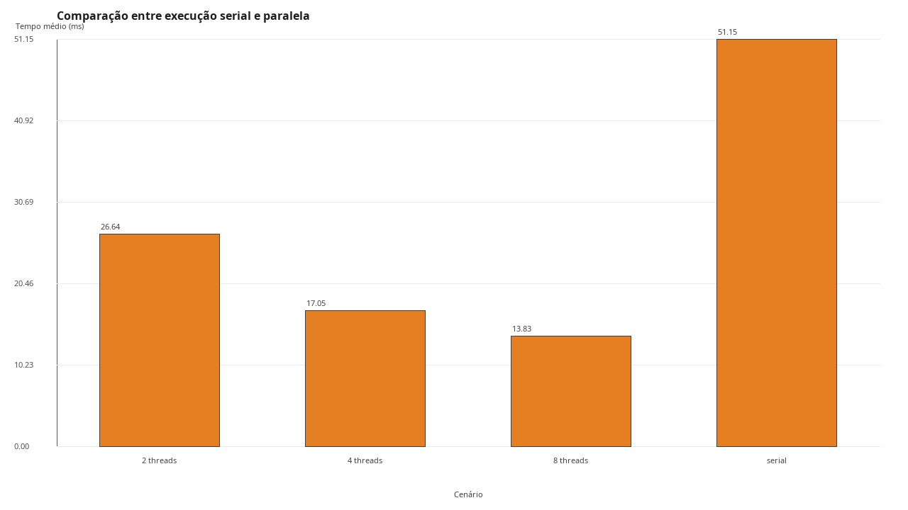

*Figura 2. Comparação entre execução serial e paralela do Merge Sort.*

A Figura 2 apresenta a comparação entre as execuções serial e paralela do Merge Sort no cenário de entrada aleatória com 500.000 elementos. O tempo médio da versão serial foi de 51,151 ms, enquanto as versões paralelas obtiveram 26,643 ms com 2 threads, 17,052 ms com 4 threads e 13,828 ms com 8 threads. Os speedups observados foram de, aproximadamente, 1,920, 3,000 e 3,699, o que demonstra que o algoritmo também se beneficia significativamente da execução concorrente.

O bom desempenho paralelo do Merge Sort está conectado à sua divisão equilibrada da entrada. Como o vetor é sempre separado em duas metades, a distribuição de trabalho entre as threads tende a ser mais uniforme. Isso contribui para uma escalabilidade mais regular. Todavia, o algoritmo continua a exigir a intercalação dos resultados e o uso de memória auxiliar, o que aumenta o custo constante da implementação. Dessa forma, mesmo ao escalar bem, ele permaneceu mais lento que o Quick Sort em tempo integral.

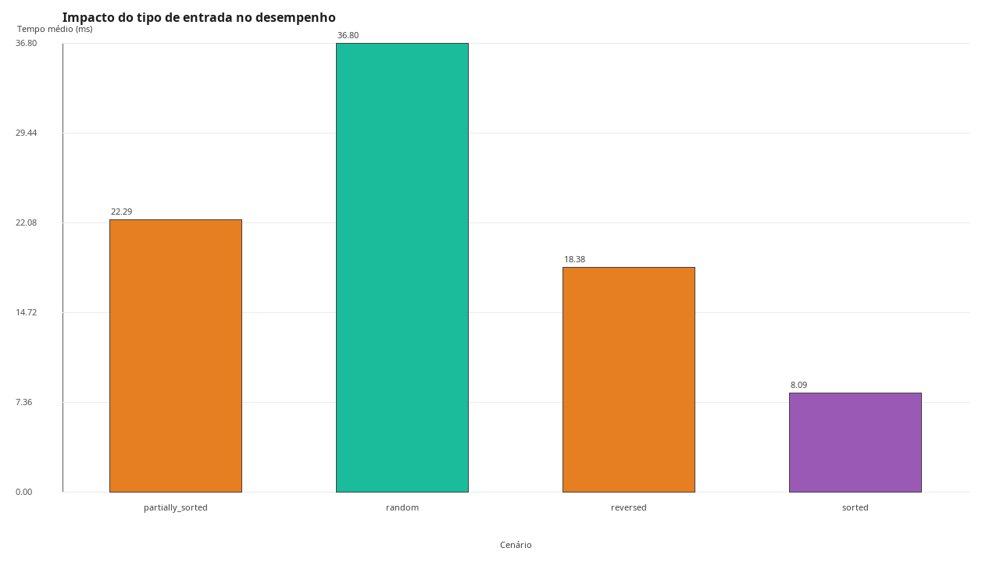

*Figura 3. Impacto do tipo de entrada no desempenho do Quick Sort.*

A Figura 3 indica que o Quick Sort teve um desempenho sensível ao tipo de entrada. Em modo serial e com 500.000 elementos, os tempos médios foram de 8,095 ms para entrada `sorted`, 18,377 ms para `reversed`, 22,290 ms para `partially_sorted` e 36,795 ms para `random`. O melhor desempenho ocorreu na entrada ordenada, enquanto a entrada aleatória foi a mais custosa.

Esse comportamento está diretamente relacionado à estratégia de escolha do pivô. Como a implementação adota a mediana de três, entradas ordenadas e invertidas deixam de representar necessariamente um cenário ruim, pois a seleção do pivô tende a produzir partições mais equilibradas. Já em entradas aleatórias, o algoritmo realiza mais trocas e opera sobre uma distribuição menos previsível, o que aumenta o custo prático do particionamento. Assim, a Figura 3 mostra que o desempenho do Quick Sort depende não apenas da complexidade teórica, mas também da forma como a implementação lida com a estrutura real da entrada.

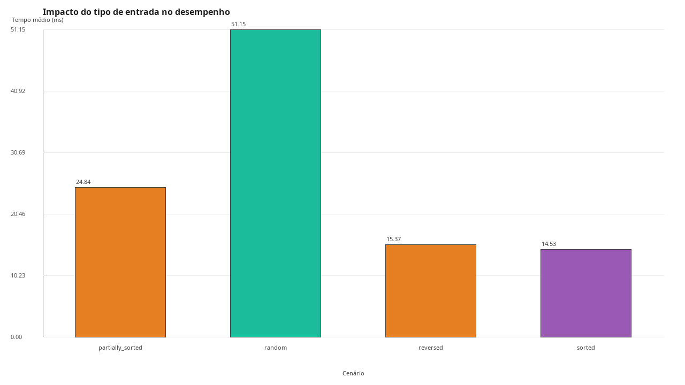

*Figura 4. Impacto do tipo de entrada no desempenho do Merge Sort.*

Na Figura 4, o Merge Sort também apresentou variação de desempenho conforme o tipo de entrada. Os tempos médios medidos em execução serial com 500.000 elementos foram 14,529 ms para `sorted`, 15,374 ms para `reversed`, 24,844 ms para `partially_sorted` e 51,151 ms para `random`. Embora sua complexidade assintótica permaneça `O(n log n)` em todos os casos, os resultados mostram que a implementação real ainda sofre influência da organização inicial dos dados.

A explicação para isso está no custo prático da fase de merge. Entradas invertidas ou ordenadas possuem uma tendência a produzir intercalações mais previsíveis, com melhor padrão de acesso à memória e menor alternância entre comparações. Já em entradas aleatórias, a intercalação torna-se mais intensa, com maior mistura entre as metades e maior movimentação de dados. Dessa forma, a Figura 4 mostra que, mesmo em algoritmos teoricamente estáveis, fatores como cache, cópias de memória e padrão de leitura e escrita influenciam o tempo final de execução.

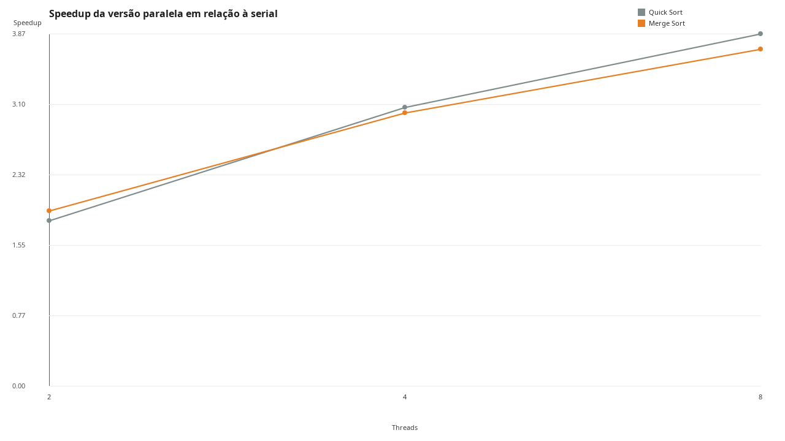

*Figura 5. Speedup da versão paralela em relação à serial para Quick Sort e Merge Sort.*

A Figura 5 reúne Quick Sort e Merge Sort em um mesmo gráfico de speedup, o que permite observar como os dois algoritmos transformam o aumento do número de threads em ganho efetivo de desempenho. O Quick Sort apresentou speedups de 1,814, 3,060 e 3,871 com 2, 4 e 8 threads, enquanto o Merge Sort registrou 1,920, 3,000 e 3,699 nas mesmas configurações.

Os dois algoritmos se mostraram adequados ao paralelismo, mas por razões ligeiramente diferentes. O Quick Sort se destacou pelo melhor tempo absoluto, ao beneficiar-se de sua operação *in-place* e de menor custo constante. O Merge Sort, por sua vez, apresentou um crescimento bastante regular, favorecido pela divisão simétrica da entrada. Entretanto, em ambos os casos, o ganho ficou abaixo do ideal, o que confirma a existência de sobrecarga paralela e de partes do algoritmo que continuam dependentes de execução sequencial.

Em conjunto, as Figuras 1 a 5 mostram que Quick Sort e Merge Sort foram os algoritmos que melhor aproveitaram o paralelismo no projeto. Ambos apresentaram uma redução real do tempo de execução com o aumento do número de threads, sendo particularmente adequados para entradas maiores. Além disso, os resultados mostram que o tipo de entrada também influencia o desempenho, embora em intensidade menor do que nos algoritmos quadráticos analisados a seguir.

### 2. Insertion Sort e Selection Sort

Na segunda parte da análise, são examinados Insertion Sort e Selection Sort, algoritmos de comportamento quadrático `O(n²)`. Diferentemente dos algoritmos anteriores, esses métodos possuem forte dependência sequencial entre as etapas de execução, o que torna mais desafiadora a obtenção de ganhos reais com o uso de múltiplas threads. Nesta parte, o objetivo é mostrar não apenas o desempenho absoluto desses algoritmos, mas também em que medida o paralelismo deixa de ser vantajoso.

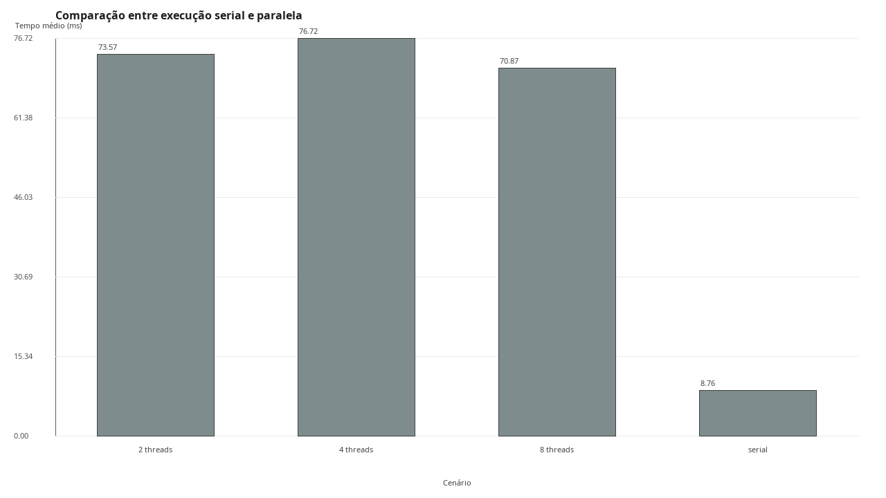

*Figura 6. Comparação entre execução serial e paralela do Insertion Sort.*

A Figura 6 apresenta a comparação entre a versão serial e a versão paralela do Insertion Sort com entrada aleatória de 10.000 elementos. A execução serial registrou tempo médio de 8,759 ms, enquanto as execuções paralelas obtiveram 73,574 ms com 2 threads, 76,719 ms com 4 threads e 70,868 ms com 8 threads. Em todas as configurações, a versão paralela foi muito mais lenta do que a serial.

Esse resultado mostra que o paralelismo implementado não foi capaz de compensar a natureza essencialmente sequencial do Insertion Sort. O algoritmo depende de uma construção progressiva da porção ordenada do vetor, de modo que cada nova inserção utiliza diretamente o estado produzido pela etapa anterior. Mesmo que a busca da posição de inserção tenha sido paralelizada, o deslocamento dos elementos e a dependência entre iterações permanecem fortemente sequenciais. Com isso, o custo do gerenciamento das tarefas paralelas supera o benefício computacional, o que torna a execução com threads ineficiente.

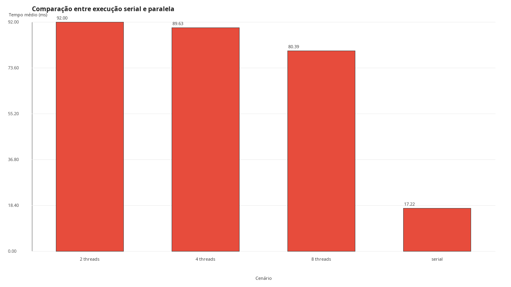

*Figura 7. Comparação entre execução serial e paralela do Selection Sort.*

A Figura 7 mostra a comparação entre as execuções serial e paralela do Selection Sort para entrada aleatória com 10.000 elementos. O tempo médio da execução serial foi de 17,215 ms, enquanto as execuções paralelas apresentaram 92,002 ms com 2 threads, 89,627 ms com 4 threads e 80,393 ms com 8 threads. Assim como no Insertion Sort, a paralelização não trouxe melhoria prática.

A explicação está no fato de que o Selection Sort continua dependente de um laço externo sequencial, no qual cada iteração precisa ser concluída antes que a próxima comece. A parte paralelizada no projeto foi a busca do menor elemento do trecho restante, o que representa apenas uma fração do algoritmo. Embora essa busca possa ser dividida entre threads, o ganho obtido nessa redução não foi suficiente para compensar os custos adicionais do `ForkJoinPool`. Portanto, a Figura 7 mostra que o paralelismo, quando aplicado a um algoritmo com forte dependência iterativa, pode até piorar o desempenho.

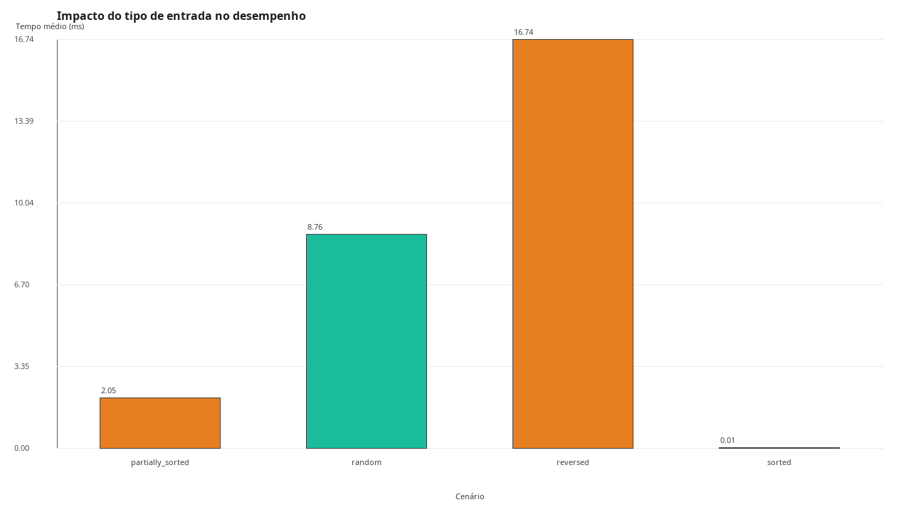

*Figura 8. Impacto do tipo de entrada no desempenho do Insertion Sort.*

A Figura 8 destaca a forte sensibilidade do Insertion Sort ao tipo de entrada. Em execução serial com 10.000 elementos, os tempos médios foram 0,009 ms para `sorted`, 2,054 ms para `partially_sorted`, 8,759 ms para `random` e 16,739 ms para `reversed`. A diferença entre o melhor e o pior caso foi extremamente alta.

Esse resultado é coerente com a natureza adaptativa do algoritmo. Quando o vetor já está ordenado, quase nenhum deslocamento é necessário, e a execução se aproxima de um custo linear. Em vetores parcialmente ordenados, ainda existe trabalho de correção, mas a quantidade de movimentações continua relativamente pequena. Já em entradas aleatórias e, sobretudo, invertidas, o número de deslocamentos cresce fortemente, o que permite que o comportamento quadrático apareça de forma mais evidente. Por isso, o Insertion Sort pode ser muito eficiente em cenários específicos, mas perde desempenho rapidamente quando a desordem aumenta.

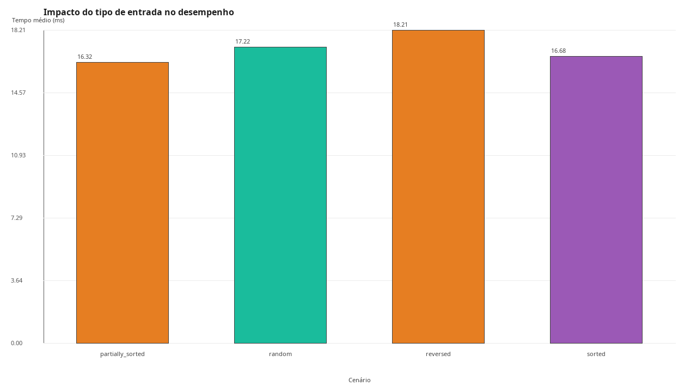

*Figura 9. Impacto do tipo de entrada no desempenho do Selection Sort.*

A Figura 9 mostra que o Selection Sort foi bem menos sensível ao tipo de entrada do que o Insertion Sort. Os tempos médios registrados foram 16,681 ms para `sorted`, 16,320 ms para `partially_sorted`, 17,215 ms para `random` e 18,213 ms para `reversed`. A variação entre melhor e pior caso foi pequena.

Essa estabilidade ocorre porque o Selection Sort sempre percorre praticamente toda a parte não ordenada do vetor em busca do menor elemento, independentemente da organização inicial dos dados. Em outras palavras, o número de comparações permanece alto em quase todos os cenários. Assim, a ordem prévia do vetor pouco altera o comportamento do algoritmo. O resultado mostra que o Selection Sort é previsível em relação ao tipo de entrada, mas essa previsibilidade não se converte em desempenho elevado.

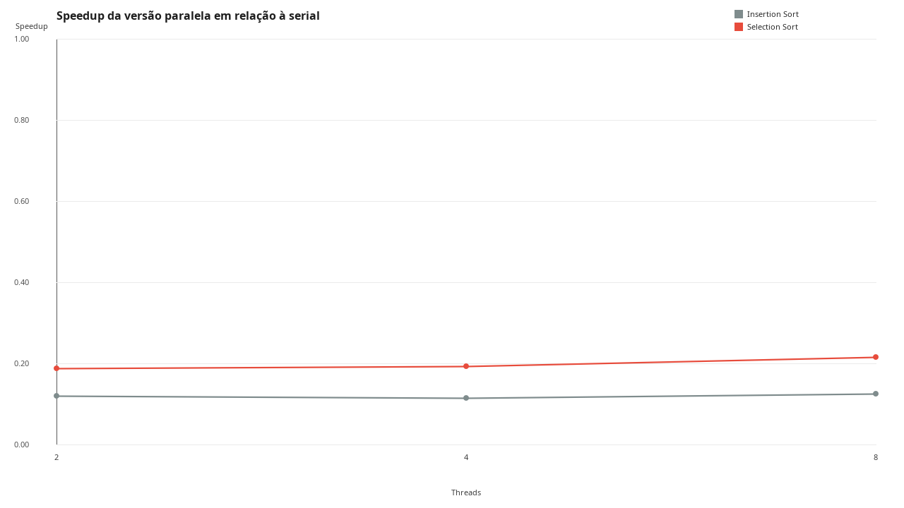

*Figura 10. Speedup da versão paralela em relação à serial para Insertion Sort e Selection Sort.*

A Figura 10 resume o comportamento paralelo dos dois algoritmos quadráticos. O Insertion Sort apresentou speedups de 0,119, 0,114 e 0,124 com 2, 4 e 8 threads, respectivamente. O Selection Sort apresentou 0,187, 0,192 e 0,214 nas mesmas configurações. Como todos os valores ficaram abaixo de 1, conclui-se que a versão paralela foi inferior à serial em todos os cenários avaliados.

Esse resultado reforça uma conclusão central do trabalho: mais threads não garantem maior desempenho. Para que o paralelismo seja vantajoso, o algoritmo precisa oferecer subtarefas suficientemente independentes e com granulação adequada. No caso de Insertion Sort e Selection Sort, a dependência entre etapas e o volume relativamente pequeno de trabalho útil por subtarefa fizeram com que a sobrecarga paralela superasse os benefícios da execução concorrente.

As Figuras 6 a 10 mostram que Insertion Sort e Selection Sort apresentaram limitações claras em ambientes paralelos. Enquanto o Insertion Sort se destacou por sua forte sensibilidade à ordem inicial dos dados, o Selection Sort apresentou comportamento mais uniforme, porém sem bom desempenho geral. Em ambos os casos, o paralelismo não se mostrou adequado e reforça que a eficiência paralela depende diretamente da estrutura do algoritmo.

### 3. Comparação entre os algoritmos

Por fim, é realizada uma comparação mais ampla entre os quatro algoritmos avaliados, buscando relacionar comportamento assintótico, escalabilidade, adaptação ao tipo de entrada e aproveitamento do paralelismo. Essa etapa permite consolidar os resultados anteriores e destacar os principais contrastes entre a família de algoritmos `O(n log n)` e a família `O(n²)`.

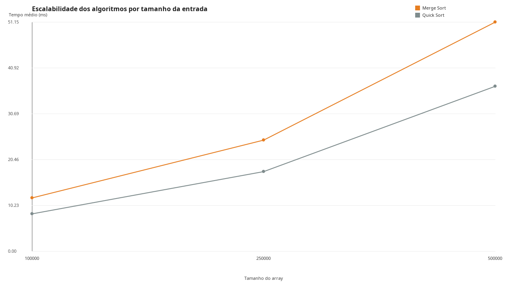

*Figura 11. Escalabilidade dos algoritmos por tamanho da entrada para Quick Sort e Merge Sort.*

A Figura 11 compara Quick Sort e Merge Sort em modo serial, com entrada aleatória e tamanhos de 100.000, 250.000 e 500.000 elementos. O Quick Sort apresentou 8,331 ms, 17,785 ms e 36,795 ms, enquanto o Merge Sort registrou 11,894 ms, 24,791 ms e 51,151 ms. Em toda a faixa analisada, o Quick Sort permaneceu mais rápido.

Esse resultado mostra que, embora ambos pertençam à classe `O(n log n)`, seus custos práticos são diferentes. O Quick Sort se beneficia do fato de trabalhar *in-place*, com menor custo de memória e menor movimentação adicional de dados. O Merge Sort, apesar de sua divisão equilibrada e comportamento estável, precisa usar vetor auxiliar e realizar intercalações sucessivas. Assim, a Figura 11 mostra que algoritmos da mesma classe assintótica ainda podem apresentar diferenças relevantes em desempenho real.

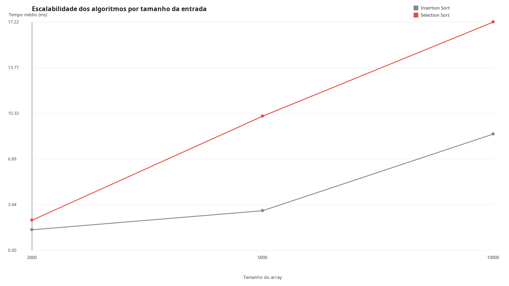

*Figura 12. Escalabilidade dos algoritmos por tamanho da entrada para Insertion Sort e Selection Sort.*

A Figura 12 compara os algoritmos quadráticos em execução serial com entrada aleatória e tamanhos de 2.000, 5.000 e 10.000 elementos. O Insertion Sort registrou 1,542 ms, 2,985 ms e 8,759 ms, enquanto o Selection Sort apresentou 2,260 ms, 10,104 ms e 17,215 ms. O Insertion Sort foi mais rápido em todos os tamanhos.

Embora ambos os algoritmos tenham complexidade `O(n²)`, o Selection Sort mantém um custo alto de comparações independentemente da estrutura da entrada, enquanto o Insertion Sort consegue se beneficiar melhor de deslocamentos contíguos e de alguma ordem parcial quando ela existe. Além disso, o fato de esses algoritmos terem sido testados com tamanhos bem menores do que os usados em Quick Sort e Merge Sort evidencia uma limitação prática importante: o crescimento quadrático torna inviável a expansão para volumes muito maiores de dados.

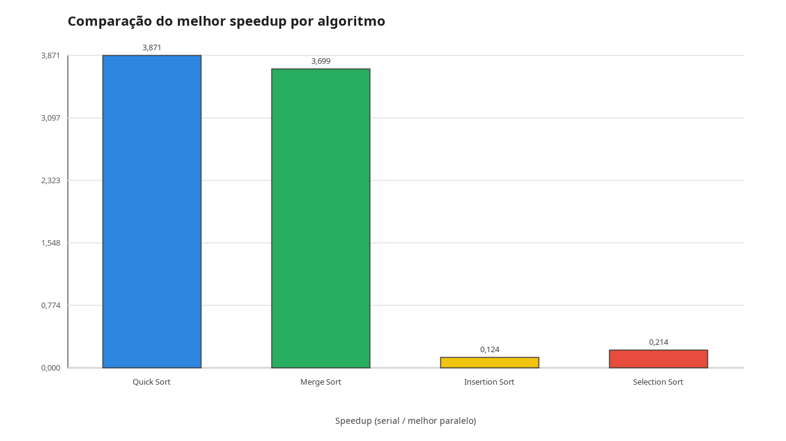

*Figura 13. Comparação do melhor speedup por algoritmo.*

A Figura 13 sintetiza o melhor speedup observado para cada algoritmo no maior cenário de entrada aleatória configurado no projeto. Os valores obtidos foram 3,871 para Quick Sort, 3,699 para Merge Sort, 0,124 para Insertion Sort e 0,214 para Selection Sort. Esses resultados dividem claramente os algoritmos em dois grupos: aqueles em que o paralelismo gerou aceleração real e aqueles em que a paralelização se mostrou contraproducente.

Essa separação confirma que o fator decisivo não é apenas a disponibilidade de múltiplos núcleos, mas a adequação da estrutura do algoritmo à decomposição paralela. Quick Sort e Merge Sort possuem subtarefas recursivas independentes em nível alto; já Insertion Sort e Selection Sort mantêm forte dependência entre etapas e o paralelismo é utilizado apenas em partes limitadas do processamento. A Figura 13, portanto, resume de forma direta a principal conclusão experimental do trabalho.

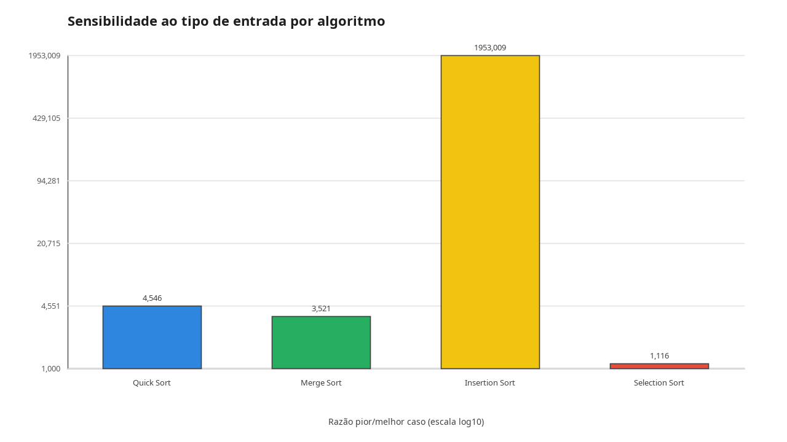

*Figura 14. Sensibilidade ao tipo de entrada por algoritmo.*

A Figura 14 compara a sensibilidade de cada algoritmo ao tipo de entrada por meio da razão entre o pior e o melhor tempo médio serial no maior cenário de cada método. As razões obtidas foram 4,546 para Quick Sort, 3,521 para Merge Sort, 1953,009 para Insertion Sort e 1,116 para Selection Sort. O Insertion Sort foi, de longe, o algoritmo mais dependente da organização inicial dos dados, enquanto o Selection Sort foi o menos sensível.

Esse resultado sintetiza bem o perfil de cada método. O Insertion Sort é altamente adaptativo e pode ter desempenho extremamente baixo em entradas ordenadas, mas se degrada intensamente quando a desordem aumenta. O Selection Sort, por outro lado, realiza praticamente o mesmo volume de comparações em quase todos os cenários, o que explica sua baixa sensibilidade. Quick Sort e Merge Sort ficaram em posição intermediária e revelam que o tipo de entrada continua importante, mas não domina completamente o comportamento desses algoritmos como acontece no Insertion Sort.

De forma geral, os resultados mostraram que Quick Sort e Merge Sort foram as alternativas mais adequadas para exploração do paralelismo no contexto deste projeto. Ambos apresentaram ganhos reais com o aumento do número de threads e mantêm desempenho competitivo em entradas maiores e desordenadas. O Quick Sort obteve os melhores tempos absolutos, enquanto o Merge Sort apresentou escalabilidade paralela bastante regular.

Em contrapartida, Insertion Sort e Selection Sort evidenciaram as limitações do paralelismo quando aplicado a algoritmos com forte dependência sequencial e comportamento quadrático. Em ambos os casos, a versão paralela foi inferior à serial, o que demonstra que a simples divisão de trabalho entre threads não garante melhora de desempenho. Além disso, a análise do tipo de entrada mostrou comportamentos muito distintos entre os métodos e reforça que a escolha do algoritmo mais adequado deve considerar simultaneamente complexidade teórica, organização dos dados e custo prático de execução.

## Conclusão

Destarte, os experimentos realizados mostraram que desempenho paralelo não é uma propriedade do hardware e sim uma propriedade do algoritmo. Quick Sort e Merge Sort se beneficiaram do paralelismo porque sua estrutura recursiva permite dividir o problema em partes independentes; Insertion Sort e Selection Sort, ao contrário, têm etapas que dependem umas das outras, de forma que nenhum número de threads resolve essa limitação.

Outro ponto que os resultados deixaram claro é que complexidade teórica e desempenho prático não são a mesma coisa. Dois algoritmos `O(n log n)` podem ter custos reais bem diferentes, assim como dois algoritmos `O(n²)` podem se comportar de formas opostas dependendo da entrada.

Mais do que confirmar o que a teoria já previa, este trabalho mostrou onde e por que a teoria encontra seus limites, e isso só foi possível pela combinação entre implementação, medição experimental e análise estatística dos resultados.

## Referências

- BRITANNICA. *Computer science*. Encyclopaedia Britannica, 2026. Disponível em: <https://www.britannica.com/science/computer-science>. Acesso em: 1 maio 2026.
- BRITANNICA. *Parallel and distributed computing*. Encyclopaedia Britannica, 2026. Disponível em: <https://www.britannica.com/science/computer-science/Parallel-and-distributed-computing>. Acesso em: 1 maio 2026.
- GEEKSFORGEEKS. *Merge Sort*. GeeksforGeeks, 3 out. 2025. Disponível em: <https://www.geeksforgeeks.org/dsa/merge-sort/>. Acesso em: 1 maio 2026.
- GEEKSFORGEEKS. *Quick Sort*. GeeksforGeeks, 8 dez. 2025. Disponível em: <https://www.geeksforgeeks.org/dsa/quick-sort-algorithm/>. Acesso em: 3 maio 2026.
- HERLIHY, Maurice; SHAVIT, Nir. *The Art of Multiprocessor Programming*. Revised 1st ed. Waltham, MA: Morgan Kaufmann, 2012. Acesso em: 3 maio 2026.
- LEA, Doug. *Concurrent Programming in Java: Design Principles and Patterns*. 2. ed. Reading, MA: Addison-Wesley, 2000. Acesso em: 3 maio 2026.
- GOETZ, Brian; PEIERLS, Tim; BLOCH, Joshua; BOWBEER, Joseph; HOLMES, David; LEA, Doug. *Java Concurrency in Practice*. Boston: Addison-Wesley, 2006. Acesso em: 3 maio 2026.
- SEDGEWICK, Robert; WAYNE, Kevin. *Algorithms*. 4. ed. Boston: Addison-Wesley, 2011. Acesso em: 3 maio 2026.
